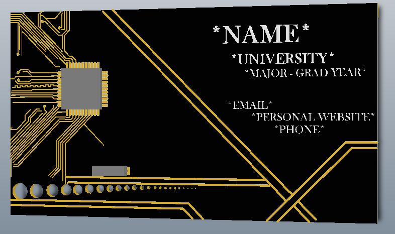
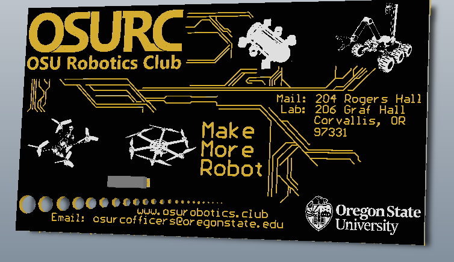

#	Business Cards

I saw Ilia Baranov's CircuitMaker project for custom made Business Cards that were etched in silver/gold plating and a matte black soldermask. They looked very clean and professional and 
I thought they would be a good way to highlight my skills in making PCBs. So this project was dedicated to making my own for myself as well as for the OSU Robotics Club. 

## Personal Cards

##	OSURC Cards

