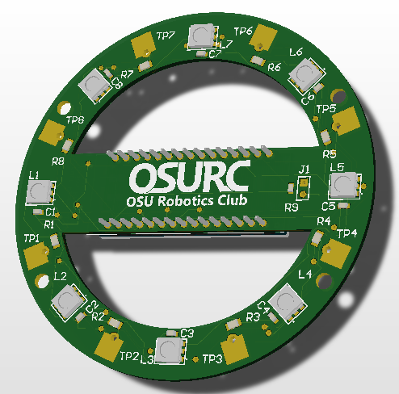
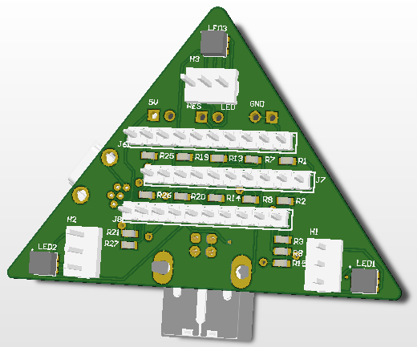

#	Circuits For Kids

The OSU Robotics Club does a variety of events that have to do with showing kids how electronics/robotics work. 
I made these projects to achieve this goal. Each project showcases some form of electrical concept in an easy to use, fun way. 

## Fruit Piano

This project was based on the Makey-Makey product, in which you can attach alligator clips to various objects and when grounding yourself, you 
can touch them and a sound will play. This uses neopixels and an Aux cord output (in the form of 2 headers). The concepts taught are resistance, 
circuit competition,  

## RGB LEDs

For this project the idea was to have many different ports that would be connected to varying resitors and LEDs. By completing 
the circuit the kids are able to create different colors on 3 LEDs. 

